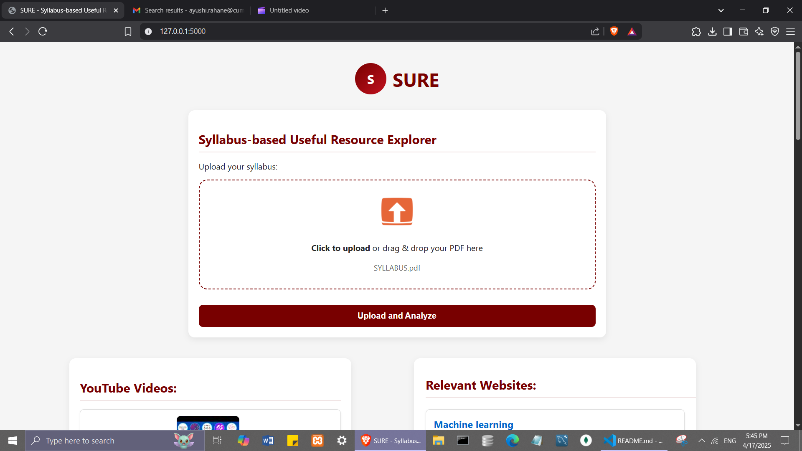
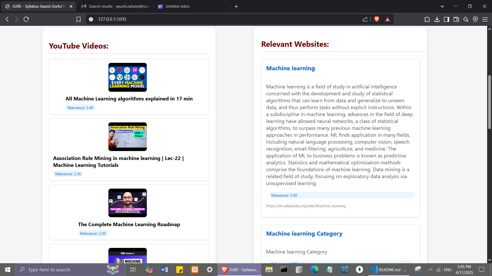

# 📚 SURE – Syllabus-based Useful Resource Explorer

> 🏆 **DSA Project Submission for Buffer 6.0 – Organized by Team Loop, Cummins College of Engineering**
>
> 🎯 **Theme:** Next-Gen Academic Solutions  
> 📽️ **Demo Video:** https://drive.google.com/file/d/1tUKZsmlVr_P0Yc2FiCMPBvpjjUVx_Vx9/view?usp=sharing

---
## 🚀 Project Overview
**Problem Statement:** Syllabus-Based Educational Resource Recommendation Platform

**SURE (Syllabus-based Useful Resource Explorer)** is a smart academic support tool that allows students to upload their **syllabus PDF** and instantly receive a list of **relevant YouTube videos** and **web resources** for each topic.

It uses **Data Structures and Algorithms (DSA)** such as **priority queues**, **text similarity ranking**, and **custom parsing logic** to extract topics and recommend learning material — all in a few seconds.

> ✨ Say goodbye to wasting time on irrelevant search results!

---

## 📷 Screenshots

### Main Section

---

## 🔧 Tech Stack

| Layer       | Technology Used |
|-------------|-----------------|
| Frontend    | HTML, CSS, JavaScript |
| Backend     | Python, Flask |
| PDF Parsing | PyMuPDF (`fitz`) |
| Relevance Engine | Custom DSA (priority queue, similarity scoring) |

---
## 🎯 Key Features

- 📄 Upload any university syllabus in PDF format
- 🧠 Automatically extracts and processes topic names
- 📺 Recommends relevant YouTube tutorials for each topic
- ⚙️ Ranks content based on topic relevance using DSA
- ✅ Easy-to-use, clean interface

---

## 📌 Future Scope
🔍 Use advanced NLP models for better topic extraction (BERT, spaCy)

📝 Add support for DOCX and PPT formats

🧠 Machine learning-based personalized video ranking

☁️ Cloud hosting and user login system

## 🙋‍♀️ Team & Acknowledgements
This project was developed as a submission for the Buffer 6.0 DSA Project Series at Cummins College, under the theme Next-Gen Academic Solutions.

We thank our mentors and Team Loop for providing this platform to learn and innovate! 🚀

